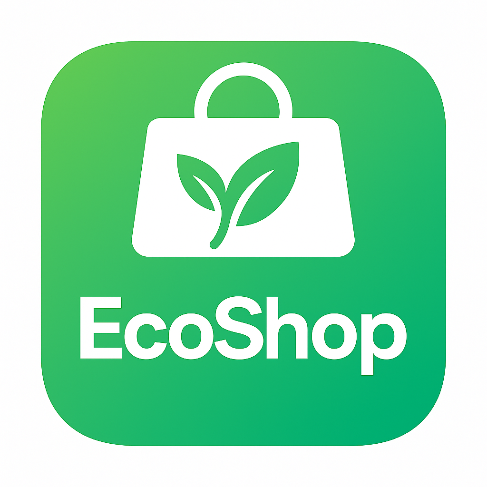

# EcoShop - Sustainability Shopping Companion

🌱 **A smart browser extension that provides real-time sustainability analysis for products on Shopee, helping you make eco-conscious shopping decisions.**



## 🚀 Quick Start Guide

### 1. **Install the Extension**

#### **Requirements:**
- **Chromium-based browser** (Chrome, Edge, Brave, Opera, etc.)
- **Developer mode** enabled

#### **Installation Steps:**

1. **Download the Extension**
   - Download the Extension.zip from the release tab
   - Extract the Extension folder to any folder such as downloads

2. **Enable Developer Mode**
   - Open your Chromium browser (Chrome, Edge, etc.)
   - Navigate to Extensions: `chrome://extensions/` (or `edge://extensions/` for Edge)
   - Toggle **"Developer mode"** switch

3. **Load the Extension**
   - Click **"Load unpacked"** button
   - Navigate to and select the `extension` folder
   - The EcoShop extension icon should appear in your browser toolbar

4. **Verify Installation**
   - Look for the EcoShop leaf icon 🌱 in your browser toolbar
   - If hidden, click the puzzle piece icon and pin EcoShop for easy access

### 2. **Ready to Use!**

The extension connects to a remote backend API automatically - no additional setup required. Simply visit any Shopee product page to start getting sustainability insights!

---

## 📱 How to Use EcoShop

### **Basic Usage:**

1. **Visit Shopee**: Navigate to any Shopee product page (shopee.sg or shopee.com)
2. **Automatic Analysis**: EcoShop automatically detects product pages and starts analysis
3. **View Results**: 
   - **Floating Badge**: Appears on the page with sustainability score
   - **Extension Popup**: Click the toolbar icon for detailed breakdown
   - **Browser Badge**: Small score indicator on the extension icon

### **Extension Interface:**

#### **📊 Main Popup** (Click extension icon)
- **Sustainability Score**: Overall rating out of 100
- **Brand Information**: Product brand name
- **Breakdown Metrics**: Three key sustainability factors:
  - **Production and Brand**: Manufacturing practices, certifications
  - **Circularity and End of Life**: Recycling, disposal impact
  - **Material Composition**: Raw materials sustainability
- **Action Buttons**:
  - **Show Details**: Deep dive into each metric
  - **View Recommendations**: Alternative sustainable products
  - **Settings**: Customize your experience
  - **Learn More**: Project information

#### **🔍 Details Page**
- **Detailed Analysis**: In-depth breakdown of each sustainability factor
- **Scoring Rationale**: Why each metric received its score
- **Raw Data**: Specifications and analysis used for scoring

#### **💡 Recommendations Page**
- **Alternative Products**: More sustainable options in similar categories
- **Comparative Scores**: Side-by-side sustainability ratings
- **Direct Links**: Navigate to recommended products

---

## ⚙️ Settings & Customization

Access settings by clicking **"Settings"** in the extension popup or right-clicking the extension icon → **"Options"**.

### **🎯 Sustainability Metrics Weights**

Customize how much each factor impacts the overall score:

- **Production and Brand** (1-5 scale)
  - Brand sustainability practices
  - Manufacturing certifications
  - Supply chain transparency

- **Circularity and End of Life** (1-5 scale)
  - Product recyclability
  - Packaging sustainability
  - Disposal impact

- **Material Composition** (1-5 scale)
  - Raw material sustainability
  - Renewable resource usage
  - Environmental impact of materials

**How it works**: Higher weights (5) make that factor more important in the final score. Lower weights (1) reduce its impact.

### **🎨 Display Settings**

#### **Show Sustainability Badge on Product Pages**
- **Enabled**: Floating badge appears on Shopee product pages
- **Disabled**: Only extension popup shows data (cleaner browsing)

#### **Badge Position**
Choose where the floating badge appears:
- **Bottom Right** (default) - Positioned above Shopee's chat button
- **Bottom Left** - Left side of screen
- **Top Right** - Upper right corner
- **Top Left** - Upper left corner

#### **Show Alternative Product Recommendations**
- **Enabled**: "View Recommendations" button appears in popup
- **Disabled**: Recommendations feature hidden (faster loading)

#### **Dark Mode**
- **Enabled** (default) - Dark theme for better readability
- **Disabled** - Light theme

#### **Senior Mode (Large Font)**
- **Enabled** - Larger text and UI elements for accessibility
- **Disabled** (default) - Standard sizing

### **💾 Settings Management**

- **Save Settings**: Apply changes and refresh all EcoShop interfaces
- **Restore Defaults**: Reset all settings to original values
- **Auto-sync**: Settings automatically sync across browser sessions

---

## 🏗️ How EcoShop Works

### **Frontend Architecture**

#### **Content Script** (`content.js`)
- **Product Detection**: Automatically identifies Shopee product pages
- **Data Extraction**: Pulls product information (brand, name, specifications)
- **Floating Badge**: Creates and positions the on-page sustainability indicator
- **Anti-Spam Protection**: Prevents duplicate requests for the same product

#### **Service Worker** (`service_worker.js`)
- **Background Processing**: Handles API communication with backend
- **Badge Management**: Updates extension icon with scores
- **Data Caching**: Optimizes performance with intelligent caching
- **Error Handling**: Graceful fallbacks when backend is unavailable

#### **Popup Interface** (`popup/`)
- **Real-time Scoring**: Calculates weighted scores based on user preferences
- **Progressive Loading**: Smooth loading experience with status updates
- **Navigation**: Seamless movement between summary, details, and recommendations
- **Settings Integration**: Live updates when preferences change

#### **Options Page** (`options/`)
- **Weight Adjustment**: Real-time sliders for metric importance
- **Display Preferences**: Toggle features and appearance settings
- **Accessibility**: Senior mode for improved readability

### **Backend Architecture**

#### **Flask API** (`app.py`)
- **RESTful Endpoints**: Clean API for product analysis requests
- **Error Handling**: Comprehensive error responses and logging
- **CORS Support**: Secure cross-origin requests from extension

#### **Analysis Pipeline** (`scripts/`)
- **Product Processing**: `shopee_processor.py` handles product data analysis
- **Scoring Engine**: `scorer.py` calculates sustainability metrics
- **Database Integration**: `db.py` manages data persistence
- **URL Parsing**: `url_parser.py` handles product URL extraction

### **Data Flow**

1. **Page Visit**: User navigates to Shopee product page
2. **Detection**: Content script identifies product information
3. **Analysis Request**: Data sent to backend API
4. **Processing**: Backend analyzes product using AI/ML models
5. **Score Calculation**: Sustainability metrics computed
6. **Display**: Results shown in floating badge and popup
7. **User Interaction**: Detailed views and recommendations available

### **Scoring Algorithm**

EcoShop uses a weighted scoring system:

```
Final Score = (P×Wp + C×Wc + M×Wm) / (Wp + Wc + Wm) × 10
```

Where:
- **P** = Production and Brand score (0-10)
- **C** = Circularity and End of Life score (0-10) 
- **M** = Material Composition score (0-10)
- **Wp, Wc, Wm** = User-defined weights (1-5)

**Score Ranges:**
- **70-100**: Excellent sustainability (Green)
- **40-69**: Good sustainability (Orange)
- **0-39**: Needs improvement (Red)

---

## 🎯 Features Overview

### **✅ Core Features**
- **Real-time Analysis**: Instant sustainability scoring on product pages
- **Customizable Weights**: Adjust scoring criteria to your values
- **Multi-view Interface**: Summary, detailed analysis, and recommendations
- **Floating Badge**: Unobtrusive on-page sustainability indicator
- **Settings Sync**: Preferences saved across browser sessions

### **🎨 User Experience**
- **Progressive Loading**: Smooth loading with status messages
- **Responsive Design**: Works on all screen sizes
- **Theme Support**: Dark/light mode options
- **Accessibility**: Senior mode for improved readability
- **Intuitive Navigation**: Easy movement between features

### **🔧 Technical Features**
- **Anti-Spam Protection**: Single request per product page
- **Intelligent Caching**: Optimized performance
- **Error Handling**: Graceful degradation when services unavailable
- **Cross-browser Support**: Works on all Chromium browsers
- **Secure Communication**: HTTPS API endpoints with CORS

### **📊 Data & Analytics**
- **Three-Factor Analysis**: Comprehensive sustainability assessment
- **Detailed Breakdowns**: Understand why products score as they do
- **Comparative Data**: See how products stack up against alternatives
- **Transparency**: Clear data sources and analysis methodology

---

## 🚀 Development & Architecture

### **Project Structure**
```
EcoShop/
├── extension/                 # Browser extension files
│   ├── manifest.json         # Extension configuration
│   ├── content.js            # Product page interaction
│   ├── service_worker.js     # Background processing
│   ├── popup/                # Main interface
│   │   ├── popup.html        # Main popup UI
│   │   ├── popup.js          # Popup logic
│   │   ├── details.html      # Detailed analysis view
│   │   ├── recommendations.html # Alternative products
│   │   └── popup.css         # Styling
│   ├── options/              # Settings page
│   │   ├── options.html      # Settings UI
│   │   ├── options.js        # Settings logic
│   │   └── options.css       # Settings styling
│   └── icons/                # Extension icons
├── backend/                  # Analysis API
│   ├── app.py               # Flask web server
│   ├── requirements.txt     # Python dependencies
│   └── scripts/             # Analysis modules
└── data/                    # Sample data files
```

### **Technology Stack**
- **Frontend**: JavaScript (ES6+), HTML5, CSS3
- **Backend**: Python, Flask, REST API
- **Browser**: Chrome Extension Manifest V3
- **Storage**: Chrome Storage API, Local Storage
- **Communication**: HTTP/HTTPS, Chrome Messaging API

---

## 🌍 Environmental Impact

EcoShop helps users make more sustainable shopping choices by:

- **Transparency**: Revealing the environmental impact of products
- **Education**: Teaching users about sustainability factors
- **Alternatives**: Suggesting eco-friendly product options
- **Awareness**: Highlighting sustainable brands and practices

**Every sustainable choice matters. EcoShop makes it easier to shop with the planet in mind.** 🌱

---

## 📞 Support & Contributing

- **Issues**: Report bugs or request features via GitHub Issues
- **Documentation**: This README covers all features and usage
- **Development**: See code comments for technical implementation details

**Happy sustainable shopping!** 🛒🌱

---

## 🛠️ Running Your Own EcoShop Backend Instance

If you want to run your own instance of the EcoShop backend:

1. **Clone the Repository**
   ```sh
   git clone https://github.com/ckwflash/LiveHack2025.git
   ```
2. **Configure API Details**
   - Open `backend/config.py` and insert your API keys or configuration as needed.

3. **Switch the Extension to Use Your Local Backend**
   - Open `extension/service_worker.js`
   - Find these lines near the top (line 20-21):
     ```js
     const API_BASE_URL = 'https://api.lxkhome.duckdns.org'; // Previous public URL
     // const API_BASE_URL = 'http://127.0.0.1:5000'; // For local development
     ```
   - Comment the first line and uncomment the second line:
     ```js
     // const API_BASE_URL = 'https://api.lxkhome.duckdns.org'; // Previous public URL
     const API_BASE_URL = 'http://127.0.0.1:5000'; // For local development
     ```
   - Save your changes.

4. **Start the Backend Server**
   ```sh
   cd backend
   python app.py
   ```

5. **Install the Extension as Usual**
   - Follow the instructions above to load the extension in your browser.

Your extension will now communicate with your local backend instance!
